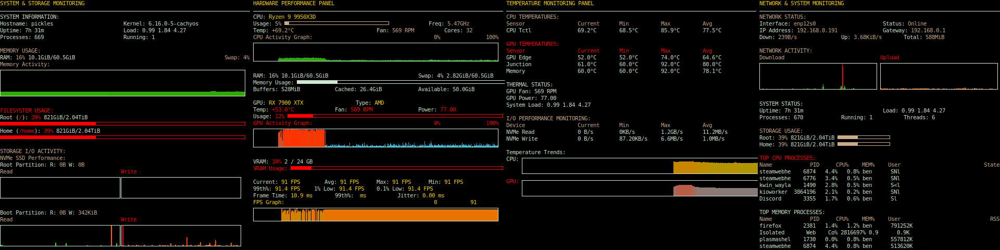

# aux-display


System monitoring for HSD088IPW1 auxiliary displays using Conky. Shows CPU, GPU, network, storage, and temperature data across 4 panels.

## Usage

1. Set display orientation: `video=HDMI-A-1:panel_orientation=right_side_up`
2. Install conky and lm-sensors
3. Run monitoring scripts:
   ```bash
   ./fps_monitor.sh  # FPS monitoring
   ./temp_stats.sh   # Temperature stats
   ./io_stats.sh     # Storage I/O stats
   ```
4. Start conky instances:
   ```bash
   conky -c conkyl.conf &    # Left panel
   conky -c conkylm.conf &   # Left-middle panel
   conky -c conkyrm.conf &   # Right-middle panel
   conky -c conkyr.conf &    # Right panel
   ```

## Features

- CPU usage, memory, and process monitoring
- GPU temperature, fan speed, and power (auto-detects AMD/NVIDIA)
- Network interface graphs and bandwidth
- NVMe temperature and I/O performance
- FPS monitoring integration (10 minute window)

## Hardware Notes

- Display: 8bpc 60Hz, 480x1920 portrait
- Mount uses friction-fit foam strips
- Conky split into 4 instances for column layout


